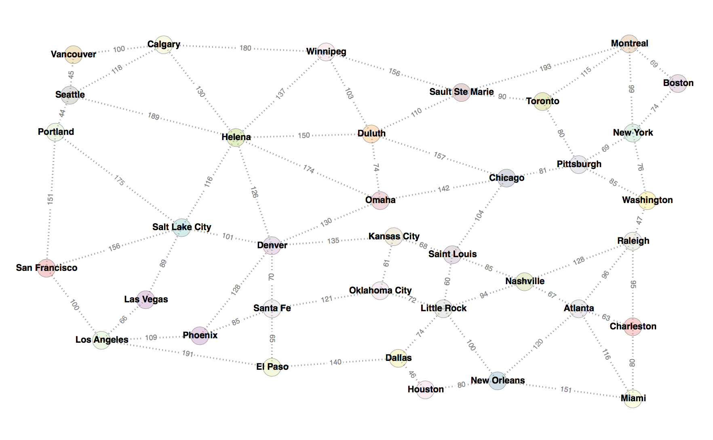

# Search
Searching through state spaces for a goal state is a common task in Computer
Science and Artificial Intelligence. Here are a number of common search
algorithms demonstrated.

If you're still reading at this point you probably have some reason to be
interested in search algorithms, so welcome to a niche crowd of humans.

## Algorithms
1. Breadth-First Search (`bfs.py`)
1. Depth-First Search (`dfs.py`)
1. Limited Depth Search (`lds.py`)
1. Iterative Deepening Search (`ids.py`)
1. Uniform-Cost Search (`ucs.py`)
1. Greedy Best-First Search (`gbfs.py`)
1. A\*/A-Star (`astar.py`)
1. IDA\*/IDA-Star (`idastar.py`)

## Problem Domain
A problem is required as the subject upon which to test the search algorithms.

I am using [n-puzzle](https://en.wikipedia.org/wiki/15_puzzle) as the subject
for most of the search algorithms because it is _"a classical problem for
modelling algorithms involving heuristics"_ and has convenient properties for
search tasks. This problem is appropriate to test algorithms like Breadth-
First Search, Depth-First Search (and variants) and algorithms that rely on a
heuristic like Greedy Best-First Search and A/IDA-Star.

I am further using a travelling search problem with data defined in the "cities"
files in ./problems/ which involves a non-uniform cost per move in addition to
an imperfect (but admissible) heuristic. These properties make this
problem useful for testing algorithms such as Uniform-Cost Search, A/IDA-Star,
but can be used to test any algorithm.



## Running
Running an algorithm over a problem using an initial state is organised by the
driver file. The script is run on the commandline using Python. It's written in
Python 3 and I haven't checked whether it works in Python 2 because that was
superseded in 2008.

Running the program requires the following arguments:

```
python3 driver.py <search algorithm> <problem> <initial-state>
```

Example input:

```
$ python3 driver.py bfs npuzzle 1,2,3,0,5,6,4,7,8
$ python3 driver.py bfs npuzzle 1,2,3,4,8,7,6,5,0
$ python3 driver.py bfs npuzzle 1,2,3,4,5,6,7,8,9,10,11,12,0,13,14,15

$ python3 driver.py dfs npuzzle 1,2,3,0,5,6,4,7,8
$ python3 driver.py lds npuzzle 1,2,3,0,5,6,4,7,8
$ python3 driver.py ids npuzzle 1,2,3,0,5,6,4,7,8
$ python3 driver.py ucs npuzzle 1,2,3,0,5,6,4,7,8
$ python3 driver.py gbfs npuzzle 1,2,3,0,5,6,4,7,8
$ python3 driver.py astar npuzzle 1,2,3,0,5,6,4,7,8
$ python3 driver.py idastar npuzzle 1,2,3,0,5,6,4,7,8

$ python3 driver.py bfs travel "Santa Fe"
$ python3 driver.py bfs travel "Calgary"

$ python3 driver.py dfs travel "Santa Fe"
$ python3 driver.py lds travel "Santa Fe"
$ python3 driver.py ids travel "Santa Fe"
$ python3 driver.py ucs travel "Santa Fe"
$ python3 driver.py gbfs travel "Santa Fe"
$ python3 driver.py astar travel "Santa Fe"
$ python3 driver.py idastar travel "Santa Fe"
```

While the program is running there is no feedback. When the search is complete
(whether successful or not) your terminal will report:

```
Search completed. Results in output.txt
```

## Warning
It is entirely possible to enter input that will have your computer searching
for a very long time. These algorithms are implemented in Python and written for
clarity, not optimised for speed. You might want to know how to stop a program
running on your terminal before you set up an unsolvable 15 square search on a
laptop that might take days (or weeks) to run.

## Another Warning
If you enter data not representing a valid initial state for a problem, crazy
things might happen. Probably you should try not to do that if you want sensible
behaviour.

## Licence
Do what you want with this, but don't try and use any of this stuff for
production code - that would be silly. Just in case:

Copyright (c) 2017 Philip Castiglione

Permission is hereby granted, free of charge, to any person obtaining a copy
of this software and associated documentation files (the "Software"), to deal
in the Software without restriction, including without limitation the rights
to use, copy, modify, merge, publish, distribute, sublicense, and/or sell
copies of the Software, and to permit persons to whom the Software is
furnished to do so, subject to the following conditions:

The above copyright notice and this permission notice shall be included in all
copies or substantial portions of the Software.

THE SOFTWARE IS PROVIDED "AS IS", WITHOUT WARRANTY OF ANY KIND, EXPRESS OR
IMPLIED, INCLUDING BUT NOT LIMITED TO THE WARRANTIES OF MERCHANTABILITY,
FITNESS FOR A PARTICULAR PURPOSE AND NONINFRINGEMENT. IN NO EVENT SHALL THE
AUTHORS OR COPYRIGHT HOLDERS BE LIABLE FOR ANY CLAIM, DAMAGES OR OTHER
LIABILITY, WHETHER IN AN ACTION OF CONTRACT, TORT OR OTHERWISE, ARISING FROM,
OUT OF OR IN CONNECTION WITH THE SOFTWARE OR THE USE OR OTHER DEALINGS IN THE
SOFTWARE.

## TODO
1. add search depth stat to results in dfs and variants?
1. add number of runs stat to results ids and ida star
1. Dijkstra's Algorithm (`dijkstra.py`)
1. Finish and refine README
1. Proper unit test for cities
1. Other unit tests?
1. refactor to n queens
1. maybe indicate stats with a prefix or something to indicate they're not integral to the algorithm
1. visualizations!
